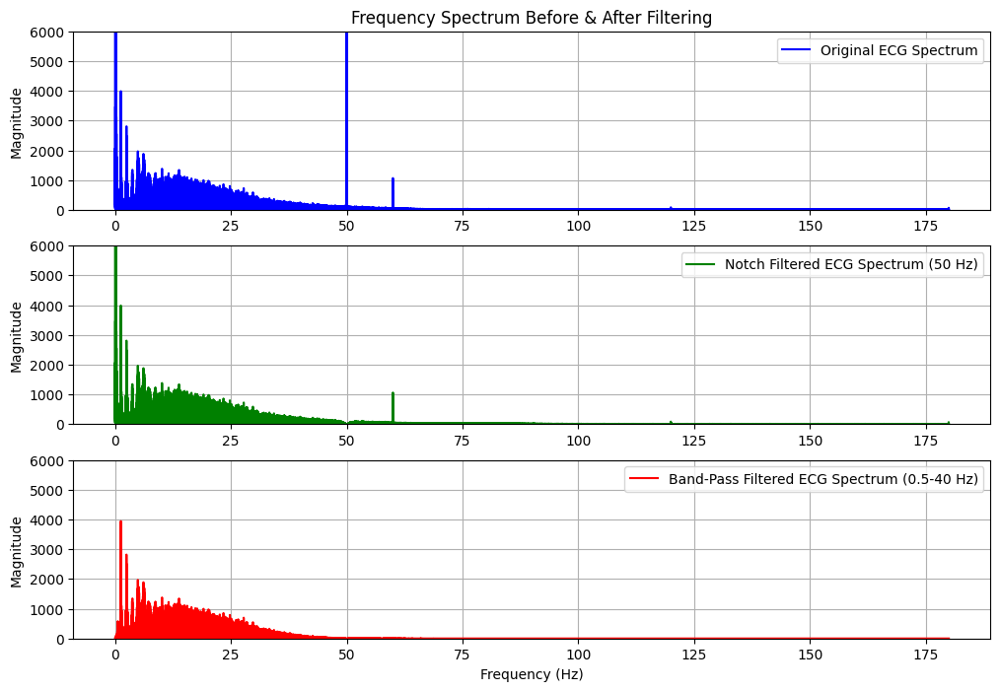
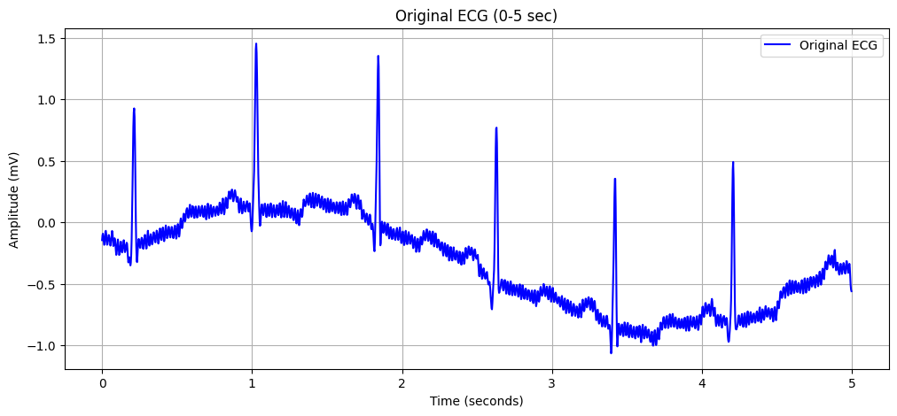
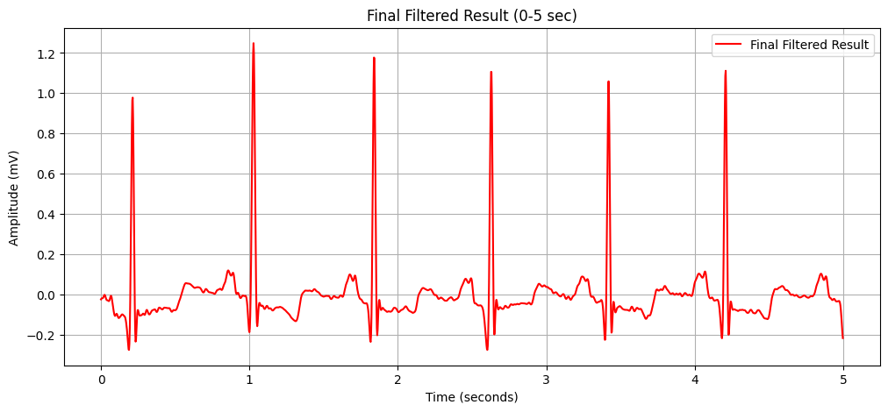

# **ECG Signal Filtering - A Beginner-Friendly Guide**

## **Introduction: Why is ECG Filtering Important?**
The **Electrocardiogram (ECG)** is a crucial tool for monitoring heart activity. However, in real-world applications, ECG signals are often **corrupted by noise**, making it difficult for doctors and AI models to analyze them correctly. Imagine a doctor trying to listen to a heartbeat while standing in a crowded, noisy market—filtering helps remove the unwanted background noise so that only the heartbeat is heard clearly.

---

## **Understanding ECG Noise: What Causes It?**
Real-world ECG recordings contain unwanted signals (noise) that can interfere with accurate heart monitoring. Some common noise sources include:

- **Baseline Wander (Low-Frequency Noise, <0.5 Hz)**  
   *Example: Imagine a patient breathing deeply during an ECG test. Their chest movement can cause slow variations in the signal, shifting the baseline up and down.*

- **Powerline Interference (50/60 Hz Noise)**  
   *Example: If you place your phone near a speaker, you sometimes hear a buzzing noise. Similarly, ECG machines pick up electrical interference from power lines, which can distort the signal.*

- **Muscle Artifacts (High-Frequency Noise, >40 Hz)**  
   *Example: If a patient moves or tenses their muscles while taking an ECG, the signal gets distorted, similar to how shaking a camera blurs an image.*

To remove these unwanted noises and preserve the true ECG features, we apply different **digital filtering techniques**.

---

## **Filtering Techniques Explained (In Simple Terms)**
Filtering helps **clean ECG signals** by removing unwanted frequency components while preserving the actual heart rhythm. We use:

1. **Notch Filter (50 Hz)** → Removes powerline noise.  
    *Example: Think of a radio picking up a single unwanted frequency. A notch filter acts like a precise tuner that blocks only that disturbance while keeping the rest of the signal intact.*

2. **Low-Pass Filter (40 Hz Cutoff)** → Removes high-frequency noise (muscle artifacts).  
    *Example: Noise-canceling headphones remove high-frequency background noise, just like a low-pass filter removes unwanted high-frequency signals from an ECG.*

3. **High-Pass Filter (0.5 Hz Cutoff)** → Removes baseline wander.  
    *Example: When taking a photo, if the lens has smudges, it blurs the entire image. A high-pass filter removes this unwanted distortion while keeping fine details.*

4. **Band-Stop Filter (45-55 Hz)** → Removes a broader range of powerline noise.  
    *Example: If there’s a loud buzzing sound in a recording, a band-stop filter removes that specific range while keeping the rest of the audio clear.*

5. **Band-Pass Filter (0.5-40 Hz)** → Retains only the necessary ECG frequency range, effectively reducing both baseline wander and high-frequency noise.  
    *Example: Think of a coffee filter—it removes coffee grounds while letting the liquid pass through. A band-pass filter removes unwanted frequencies while keeping the vital ECG components.*

---

## **How Does This Project Help?**
By applying these filters to real ECG data from the **MIT-BIH Arrhythmia Database**, we can:

**Remove unwanted noise while preserving ECG features.**  
**Analyze the effects of different filters on ECG signals.**  
**Use Fast Fourier Transform (FFT) to visualize the signal before and after filtering.**  

---

## **Results: How Filtering Improves ECG Signals**

| **Filter Type** | **Effect on ECG Signal** |
|---------------|------------------------|
| Notch Filter | Removes powerline interference at 50 Hz but may introduce distortions if not needed |
| Low-Pass Filter | Removes high-frequency noise above 40 Hz |
| High-Pass Filter | Removes low-frequency baseline wander |
| Band-Stop Filter | Removes powerline noise and harmonics |
| Band-Pass Filter | Retains only the necessary ECG frequency range (0.5 - 40 Hz), making it highly effective for ECG filtering |

**See the `results/` folder for before-and-after filtering plots.**
## Sample ECG Signal Before & After Filtering

### **Frequency Spectrum Before and After Results**


### **Original Noisy ECG**


### **Filtered ECG**


---

## **How to Use This Repository?**

### **1️⃣ Install Required Libraries**
Ensure you have Python installed, then run:
```bash
pip install wfdb numpy scipy matplotlib
```

### **2️⃣ Run Individual Filters**
To apply a specific filter, run:
```bash
python filters/band_pass.py
```

### **3️⃣ Run Full ECG Filtering Pipeline**
To apply all filters in sequence:
```bash
python ECG_Filtering_Main.py
```

### **4️⃣ Run in Jupyter Notebook (Recommended for Learning)**
Use the interactive notebook:
```bash
jupyter notebook ECG_Filtering.ipynb
```

---

## **Future Scope: AI-Based Adaptive Filtering**
Traditional filtering techniques require **manual selection of cutoff frequencies and filter types**. A more advanced approach is to use **AI-based adaptive filtering**, where:

**AI analyzes the ECG signal (via FFT) to detect noise components.**  
**It dynamically selects the best filtering technique based on real-time noise characteristics.**  
**This improves filtering precision and avoids unnecessary filtering, reducing data loss.**  

This research lays the groundwork for developing **AI-driven real-time ECG noise filtering models.**

---

## **References**
- MIT-BIH Arrhythmia Database ([PhysioNet](https://physionet.org/content/mitdb/1.0.0/))
- Digital Signal Processing Techniques for ECG Analysis

**Author:** [Venkatesan]  
**GitHub Repository:** [https://github.com/Vk4Sp/ECG-Filtering]  
**License:** MIT License  

**Contributions & Discussions are Welcome!**

