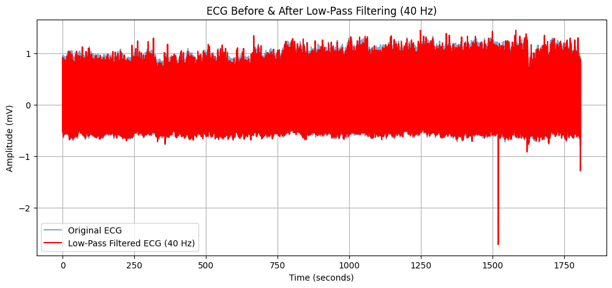
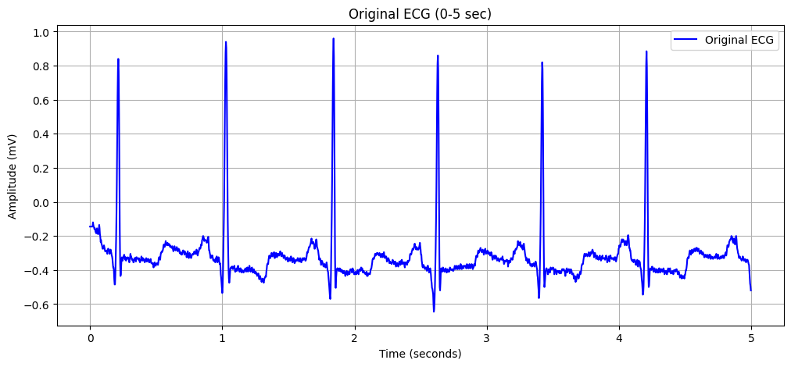
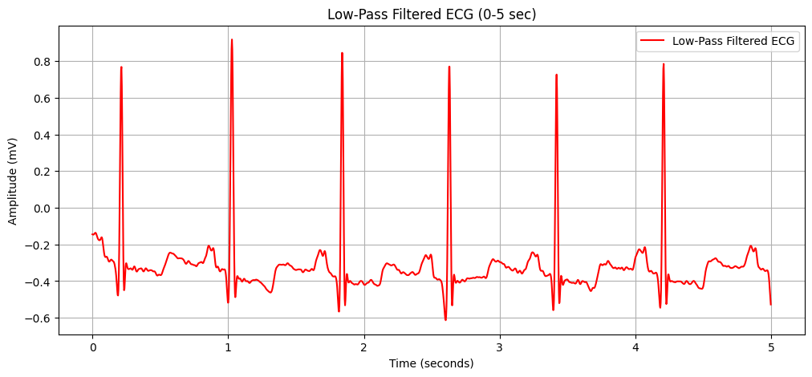
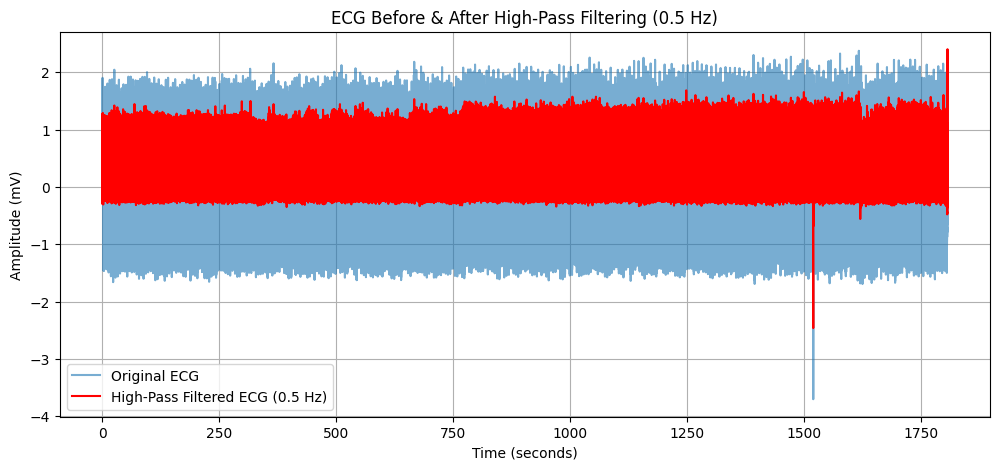
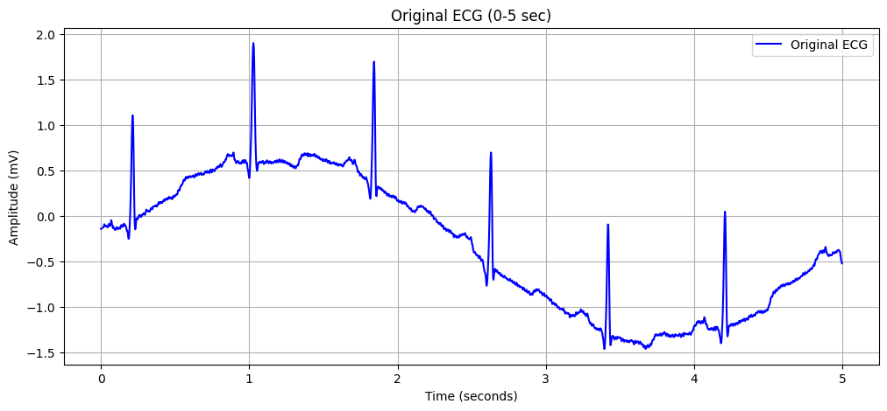
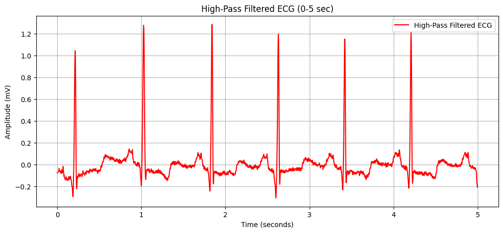

# ECG-Filtering
This repository contains a collection of signal processing techniques for filtering ECG (Electrocardiogram) signals. The project focuses on removing various types of noise from ECG recordings, such as powerline interference (50 Hz), baseline wander, and high-frequency muscle artifacts, using different filtering methods.
# ECG Signal Filtering Project

## Project Overview
This repository contains various filtering techniques for processing ECG (Electrocardiogram) signals. The goal is to remove different types of noise and artifacts to improve ECG signal quality for further analysis.

## Implemented Filters
- **Notch Filter (50 Hz):** Removes powerline interference.
- **Low-Pass Filter (40 Hz cutoff):** Eliminates high-frequency noise.
- **High-Pass Filter (0.5 Hz cutoff):** Removes baseline wander.
- **Band-Pass Filter (0.5 - 40 Hz):** Combines both low-pass and high-pass filtering.

## Results and Visualizations
This project includes before and after filtering plots to compare how noise removal affects ECG signals. Zoom functionality is implemented in the visualizations to help analyze specific sections of the ECG signal more clearly. Predefined zoom ranges are used to focus on specific time intervals.

## How to Use
1. Clone the repository:
   ```bash
   git clone https://github.com/Vk4Sp/ECG-Filtering.git
   cd ECG-Filtering
   ```
2. Install required dependencies:
   ```bash
   pip install wfdb numpy scipy matplotlib
   ```
3. Run any filter script to process ECG data:
   ```bash
   python notch_filter.py
   ```
4. View filtered ECG plots and compare results.

## Low-Pass Filter Results 
### Without Zooming


### Before & After Filtering (Zoomed View)  
**Original ECG:**  
  

**Low-Pass Filtered ECG:**  
  

## High-Pass Filter Results
Since the ECG data from the library doesn't contain low frequecny noises (Baseline disturbance). 
So, here we added a 0.2 Hz sine wave to the ECG data for understanding the implementation of High Pass Filter.

### Without Zooming


### Before & After Filtering (Zoomed View)  
**Original ECG:**  
  

**High-Pass Filtered ECG:**  
  

## Future Work
- Implement adaptive filtering for real-time ECG processing.
- Explore AI/ML-based denoising techniques.
- Process multi-lead ECG analysis.

## License
This project is licensed under the MIT License.

## Author
[Venkatesan]

## GitHub Repository
[https://github.com/Vk4Sp/ECG-Filtering]

Contributions and suggestions are welcome.
